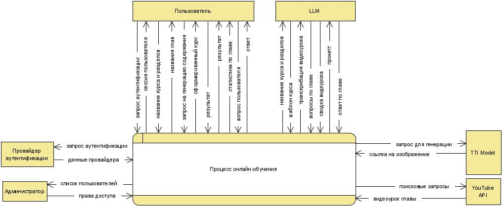
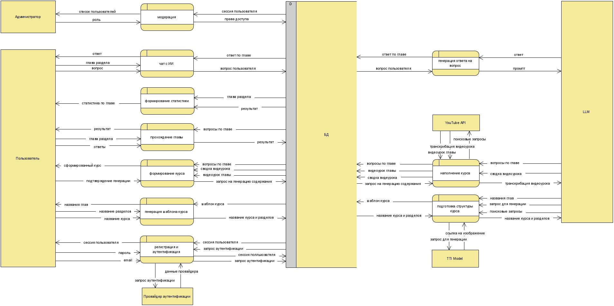
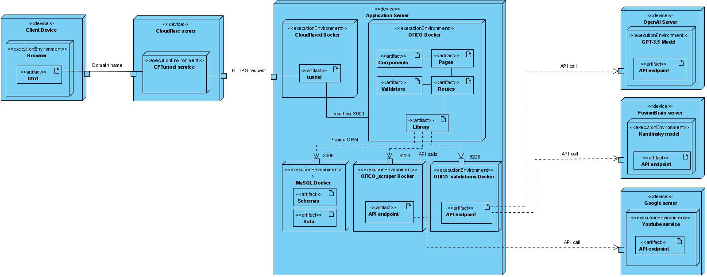
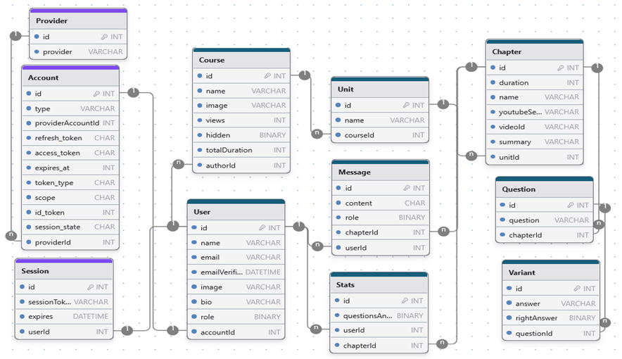

    

<h2>
	

    	<strong>
        	Personalized course generation platform
   		</strong>
	

    

    	
    	
    

</h2>

## Purpose

The system's goal is to automate the process of online self-education, which will allow generating the structure and contents of educational courses according to the needs of the learner with the help of LLM.

The platform's main features include:

- User registrations;
- Account editing;
- Course generation;
- Course managing;
- Solving tests;
- Forming a course feed;
- Moderation functionality;
- Generating reports on learning progress;
- Chatting with the AI during the learning process.

## Video Presentation

https://github.com/AcademAI/youknow/assets/102802049/1873f2a9-4870-4dc7-ba52-f7ca71d61055

## Installation

1. `git clone https://github.com/AcademAI/youknow`
2. Fill each of 3 `.env` with values (example in .env.example)
3. `docker network create <network_name>`
4. `docker-compose up -d`

## Architecture

### DFD-0

    

### DFD-1

    

### Deployment diagram

    

### Database model

    

## Star History

**[⬆ back to top](#installation)**

## License

Licensed under the CC License. See [LICENSE](LICENSE) for the full license text.
